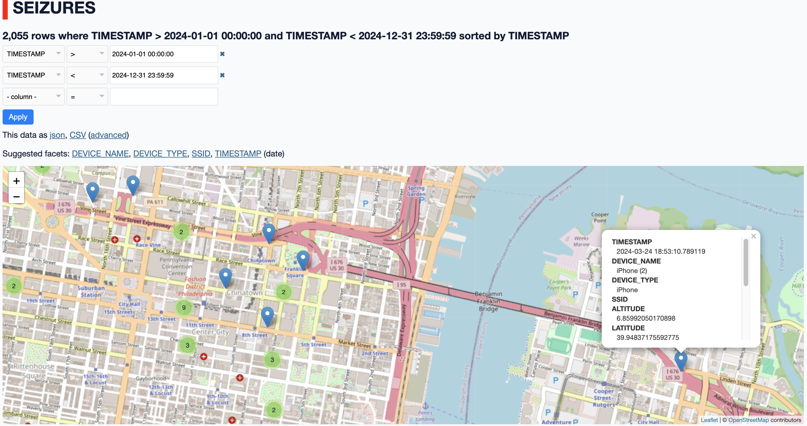

# seizures.ericoc.com

This is the source code for the Python Django application `seizures.ericoc.com`.

While the website itself is for authorized users only, there are a few example
screenshots below.

---

## Background

I use an Apple Shortcut ([Add_Seizure.shortcut](Add_Seizure.shortcut)) to track
when, and where, I have epileptic seizures.

The Apple Shortcut to track a seizure can be executed from my Apple Watch,
iPad, iPhone, or Mac with just two (2) taps.
The Apple Watch shortcut could even _theoretically_ be used by another person,
while the watch remains on my wrist.

Less detailed events can also be added from a browser.

---

## Examples

Seizures are generally displayed one of four (4) different ways -
using the Leaflet map, Highcharts chart, Datatables table, or
Datasette cluster map - shown below.

### Map

The default page, after logging in, is a map of seizures displayed using
Leaflet, in combination with OpenStreetMap.

### Chart

Seizure frequency, per day, is charted with Highcharts.

### Table

Detailed information about each seizure can be listed using DataTables which
supports copying rows to the clipboard, as well as exporting
_comma-separated values_ (`.csv`) and _Microsoft Excel_ (`.xlsx`) files.

### Datasette

Datasette expects data in SQLite, so seizures are regularly exported by Django.
Datasette has many plug-ins available, including `datasette-cluster-map`.

#### Single seizure

#### Video

---

## Technical

### API

An HTTPS REST API is made available with Django REST framework (DRF).
Seizures are added by HTTPS POST requests to the `/api/seizures/` DRF end-point,
from the Apple Shortcut.

#### Apple Shortcut

When the Apple Shortcut is executed, the Apple device sends an HTTPS JSON POST
request to the `/api/seizures/` Django REST framework end-point with token-based
authentication (using an `Authorization` request header), subsequently writing
a row to the `seizures` PostgreSQL database - a "_seizure_" - including the following data,
at the time of the event.

- Timestamp
  - _Coordinated Universal Time (UTC)_
- Device Name
- Device Type
  - `iPhone`
  - `Mac`
  - `Watch`
  - `iPad`

- Battery
  - `0` - `100`
- Brightness
  - `0` - `1`
- Volume
  - `0` - `1`

- Latitude
- Longitude

- Address
  - According to _Apple_.
- SSID
  - Not sent by _Apple Watch_.
- Altitude
  - Measured in **meters**.
  - Not sent by _MacBook_.

### Data

Seizure event data is stored in a _PostgreSQL_ database
([seizures.sql](seizures.sql)) using Django QuerySets with `psycopg`.

### Software

In addition to the custom [Apple Shortcut](https://support.apple.com/guide/shortcuts/welcome/ios),
this all depends upon the following software:

#### Database

- [PostgreSQL](https://www.postgresql.org/)
  * Seizure and Django data, including users/permissions, is stored locally in PostgreSQL.
- [SQLite](https://www.sqlite.org/)
  * Seizure data is regularly exported from PostgreSQL to SQLite (_for Datasette_) by a [scheduled `cron` job](seizures.cron),
  which executes the Django [`manage.py tosqlite`](apps/seizures/management/commands/tosqlite.py) command.

#### Interface

- [Datasette](https://datasette.io/)
  - [datasette-cluster-map](https://datasette.io/plugins/datasette-cluster-map)
- [DataTables](https://datatables.net/)
- [Highcharts](https://www.highcharts.com/)
- [Leaflet](https://leafletjs.com/)
  - [OpenStreetMap](https://www.openstreetmap.org/)

#### Web

- [nginx](https://nginx.org/)
- [Python](https://www.python.org/)
  - [gunicorn](https://gunicorn.org/)
  - [Django web framework](https://www.djangoproject.com/)
    - [Django REST framework](https://www.django-rest-framework.org/)
